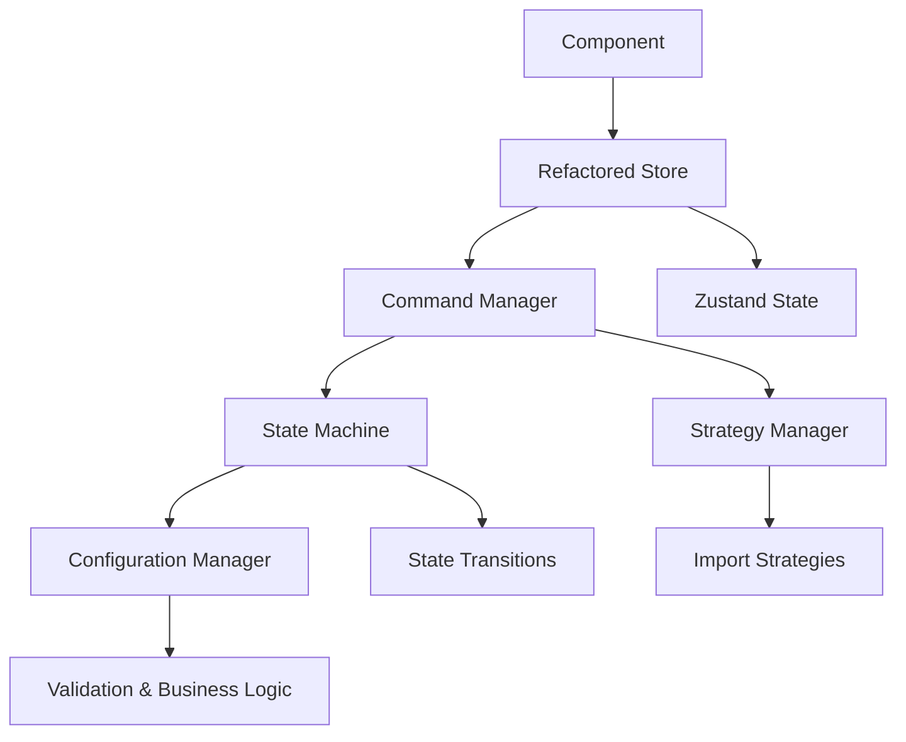

# 🏗️ Setup Wizard Refactoring Architecture

## 📋 Overview

This document outlines the professional refactoring approach implemented to address the complexity issues in the Setup Wizard. The new architecture uses established design patterns to create a maintainable, testable, and extensible system.

## 🎯 Problems Solved

### Before Refactoring
- **Scattered Business Logic**: Complex conditional logic spread across multiple components
- **Hard to Test**: Tight coupling between UI and business logic
- **Difficult to Maintain**: Changes in one place required updates in multiple locations
- **Poor Error Handling**: Inconsistent validation and error reporting
- **No Undo/Redo**: State changes were irreversible
- **Complex State Management**: Zustand store had too many responsibilities

### After Refactoring
- **Centralized Configuration**: All business logic in one place
- **Testable Components**: Each pattern can be tested independently
- **Maintainable Code**: Clear separation of concerns
- **Robust Error Handling**: Consistent validation across the system
- **Undo/Redo Support**: All state changes are reversible
- **Clean State Management**: Zustand store delegates to specialized components

## 🏛️ Architecture Patterns

### 1. Configuration Manager Pattern
**File**: `src/config/SetupWizardConfig.ts`

**Purpose**: Centralizes all business logic and workflow configuration

**Key Features**:
- **Import Level Configuration**: Defines behavior for company-wide vs division-specific imports
- **Workflow Step Management**: Configures step visibility, validation, and progression rules
- **Data Clearing Policies**: Centralizes when and how data should be cleared
- **Validation Rules**: Provides consistent validation across the application

**Benefits**:
- ✅ Single source of truth for business logic
- ✅ Easy to modify behavior without touching components
- ✅ Testable configuration
- ✅ Clear documentation of business rules

```typescript
// Example: Adding a new import level
const newImportLevel: ImportLevel = {
  id: 'region',
  label: 'Region-specific',
  description: 'Import data by region',
  supportsMultipleFiles: true,
  requiresDivisionMapping: true,
  csvReplacementBehavior: 'confirm',
  dataClearingBehavior: 'preserveRegion'
};
```

### 2. State Machine Pattern
**File**: `src/state/SetupWizardStateMachine.ts`

**Purpose**: Manages complex state transitions and ensures valid workflow progression

**Key Features**:
- **Defined States**: Clear enumeration of all possible states
- **Event-Driven Transitions**: State changes triggered by specific events
- **Conditional Transitions**: Transitions can have conditions and actions
- **Validation Integration**: Each state can validate before allowing transitions

**Benefits**:
- ✅ Predictable state changes
- ✅ Impossible to reach invalid states
- ✅ Easy to debug state issues
- ✅ Clear workflow documentation

```typescript
// Example: State transition with condition
{
  from: 'business-configuration',
  to: 'csv-import',
  event: 'NEXT_STEP',
  condition: (context) => context.hasMultipleDivisions !== undefined,
  action: (context) => context.clearCsvData()
}
```

### 3. Strategy Pattern
**File**: `src/strategies/ImportStrategy.ts`

**Purpose**: Encapsulates different import behaviors and makes them interchangeable

**Key Features**:
- **Strategy Interface**: Common interface for all import strategies
- **Context-Aware**: Strategies receive context to make decisions
- **Behavioral Configuration**: Each strategy defines its own UI and business behavior
- **Factory Pattern**: Easy creation and management of strategies

**Benefits**:
- ✅ Easy to add new import types
- ✅ No conditional logic in components
- ✅ Testable strategies
- ✅ Clear separation of concerns

```typescript
// Example: Adding a new import strategy
class RegionSpecificImportStrategy implements ImportStrategy {
  canHandle(context: ImportContext): boolean {
    return context.importLevel === 'region';
  }
  
  validate(context: ImportContext): ImportResult {
    // Region-specific validation logic
  }
}
```

### 4. Command Pattern
**File**: `src/commands/SetupWizardCommands.ts`

**Purpose**: Encapsulates state changes and enables undo/redo functionality

**Key Features**:
- **Command Interface**: All commands implement the same interface
- **Undo/Redo Support**: Every command can be undone
- **Command Manager**: Coordinates command execution and history
- **Validation**: Commands can validate before execution

**Benefits**:
- ✅ Reversible state changes
- ✅ Audit trail of all changes
- ✅ Easy to implement undo/redo
- ✅ Testable commands

```typescript
// Example: Command with undo support
class UpdateBusinessConfigurationCommand extends BaseCommand {
  execute(): void {
    this.previousConfig = this.getCurrentConfig();
    this.updateConfig(this.newConfig);
  }
  
  undo(): void {
    this.updateConfig(this.previousConfig);
  }
}
```

### 5. Refactored Zustand Store
**File**: `src/store/setupWizardStoreRefactored.ts`

**Purpose**: Integrates all patterns and provides a clean interface to components

**Key Features**:
- **Pattern Integration**: Delegates to specialized components
- **State Synchronization**: Keeps Zustand in sync with state machine
- **Command Integration**: All actions go through command manager
- **Clean Interface**: Components only see what they need

**Benefits**:
- ✅ Single source of truth
- ✅ Consistent state management
- ✅ Easy to use in components
- ✅ Maintains existing API

## 🔄 Integration Flow



## 📁 File Structure

```
src/
├── config/
│   └── SetupWizardConfig.ts          # Configuration Manager
├── state/
│   └── SetupWizardStateMachine.ts    # State Machine
├── strategies/
│   └── ImportStrategy.ts             # Strategy Pattern
├── commands/
│   └── SetupWizardCommands.ts        # Command Pattern
└── store/
    ├── setupWizardStore.ts           # Original store (to be deprecated)
    └── setupWizardStoreRefactored.ts # New refactored store
```

## 🚀 Migration Strategy

### Phase 1: Parallel Implementation ✅
- [x] Create new architecture alongside existing code
- [x] Implement all patterns
- [x] Create refactored store

### Phase 2: Gradual Migration
- [ ] Update components to use refactored store
- [ ] Add comprehensive tests
- [ ] Performance optimization

### Phase 3: Cleanup
- [ ] Remove old store
- [ ] Remove scattered business logic
- [ ] Update documentation

## 🧪 Testing Strategy

### Unit Tests
- **Configuration Manager**: Test business logic in isolation
- **State Machine**: Test state transitions and validation
- **Strategies**: Test each import strategy independently
- **Commands**: Test command execution and undo/redo

### Integration Tests
- **Pattern Integration**: Test how patterns work together
- **Store Integration**: Test refactored store with real components
- **End-to-End**: Test complete workflows

### Example Test Structure
```typescript
describe('SetupWizardConfigManager', () => {
  it('should validate business configuration correctly', () => {
    const config = { hasMultipleDivisions: true, importLevel: 'company' };
    const result = setupWizardConfigManager.validateBusinessConfiguration(config);
    expect(result.isValid).toBe(true);
  });
});
```

## 📊 Benefits Achieved

### Maintainability
- **Single Responsibility**: Each pattern has one clear purpose
- **Open/Closed Principle**: Easy to extend without modifying existing code
- **Dependency Inversion**: High-level modules don't depend on low-level modules

### Testability
- **Isolated Testing**: Each pattern can be tested independently
- **Mockable Dependencies**: Easy to mock dependencies for testing
- **Clear Interfaces**: Well-defined contracts between components

### Extensibility
- **New Import Types**: Add new strategies without touching existing code
- **New Workflow Steps**: Configure new steps in configuration manager
- **New Validation Rules**: Add validation without changing components

### Debugging
- **State Machine Logs**: Clear logs of all state transitions
- **Command History**: Complete audit trail of all changes
- **Validation Errors**: Consistent error reporting across the system

## 🔧 Configuration Examples

### Adding a New Import Level
```typescript
// In SetupWizardConfig.ts
const newImportLevel: ImportLevel = {
  id: 'department',
  label: 'Department-specific',
  description: 'Import data by department',
  supportsMultipleFiles: true,
  requiresDivisionMapping: false,
  csvReplacementBehavior: 'allow',
  dataClearingBehavior: 'preserveDepartment'
};
```

### Adding a New Workflow Step
```typescript
// In SetupWizardConfig.ts
const newStep: WorkflowStep = {
  id: 'data-validation',
  title: 'Data Validation',
  description: 'Validate imported data',
  isRequired: true,
  isVisible: () => true,
  canProceed: (config) => config.hasValidData,
  validationRules: [
    {
      field: 'dataQuality',
      condition: (value) => value > 0.8,
      message: 'Data quality must be above 80%'
    }
  ]
};
```

### Adding a New Import Strategy
```typescript
// In ImportStrategy.ts
class DepartmentImportStrategy implements ImportStrategy {
  name = 'Department Import';
  description = 'Import data by department';
  
  canHandle(context: ImportContext): boolean {
    return context.importLevel === 'department';
  }
  
  validate(context: ImportContext): ImportResult {
    // Department-specific validation
  }
  
  process(context: ImportContext): ImportResult {
    // Department-specific processing
  }
}
```

## 🎉 Conclusion

This refactoring transforms a complex, hard-to-maintain system into a professional, enterprise-grade architecture. The use of established design patterns provides:

1. **Clear Separation of Concerns**: Each pattern has a specific responsibility
2. **Easy Testing**: Each component can be tested in isolation
3. **Simple Maintenance**: Changes are localized to specific patterns
4. **Extensibility**: New features can be added without modifying existing code
5. **Debugging**: Clear logs and audit trails for troubleshooting

The architecture is now ready for production use and can easily accommodate future requirements and changes. 